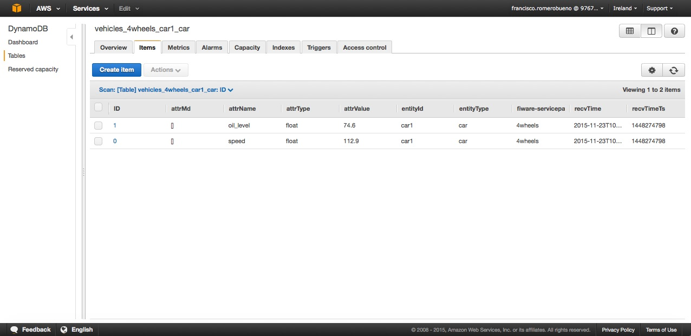
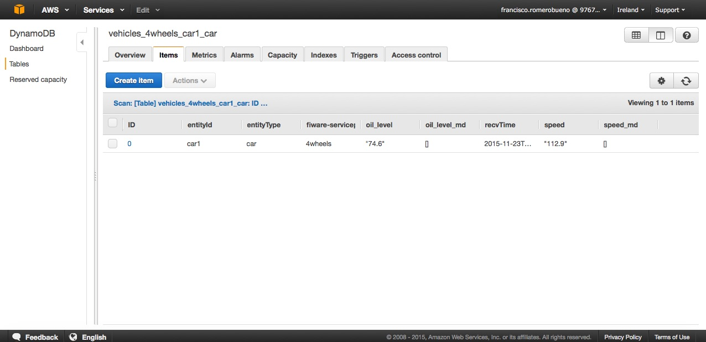
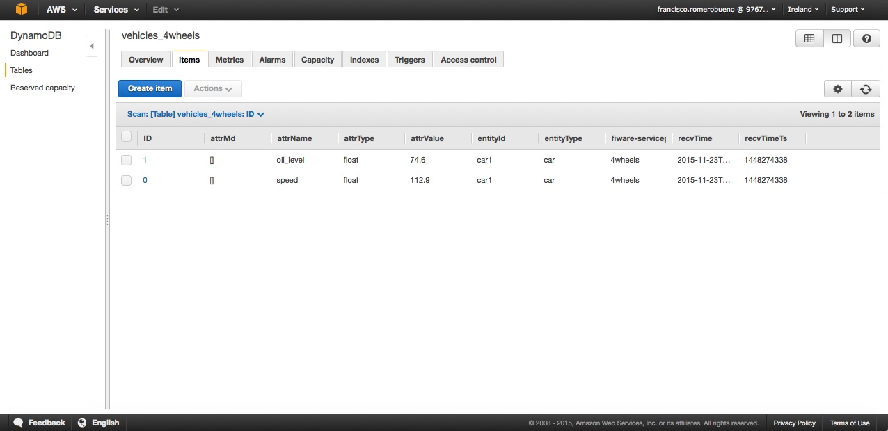

#OrionDynamoDBSink
Content:

* [Functionality](#section1)
    * [Mapping NGSI events to flume events](#section1.1)
    * [Mapping Flume events to DynamoDB data structures](#section1.2)
    * [Example](#section1.3)
* [Administrator guide](#section2)
    * [Configuration](#section2.1)
    * [Use cases](#section2.2)
    * [Important notes](#section2.3)
        * [About the table type and its relation with the grouping rules](#section2.3.1)
        * [About the persistence mode](#section2.3.2)
        * [About batching](#section2.3.3)
        * [Throughput in DynamoDB](#section2.3.4)
* [Programmers guide](#section3)
    * [`OrionDynamoDBSink` class](#section3.1)
    * [`DynamoDBBackendImpl` class](#section3.2)
* [Reporting issues and contact information](#section4)

##Functionality
`com.iot.telefonica.cygnus.sinks.OrionDynamoDBSink`, or simply `OrionDynamoDBSink` is a sink designed to persist NGSI-like context data events within a [DynamoDB database](https://aws.amazon.com/dynamodb/) in [Amazon Web Services](https://aws.amazon.com/). Usually, such a context data is notified by a [Orion Context Broker](https://github.com/telefonicaid/fiware-orion) instance, but could be any other system speaking the <i>NGSI language</i>.

Independently of the data generator, NGSI context data is always transformed into internal Flume events at Cygnus sources. In the end, the information within these Flume events must be mapped into specific DynamoDB data structures.

Next sections will explain this in detail.

[Top](#top)

###Mapping NGSI events to flume events
Notified NGSI events (containing context data) are transformed into Flume events (such an event is a mix of certain headers and a byte-based body), independently of the NGSI data generator or the final backend where it is persisted.

This is done at the Cygnus Http listeners (in Flume jergon, sources) thanks to `com.iot.telefonica.cygnus.handlers.OrionRestHandler`. Once translated, the data (now, as a Flume event) is put into the internal channels for future consumption (see next section).

Since this is a common task done by Cygnus independently of the final backend, it is documented in [this](from_ngsi_events_to_flume_events.md) other independent document.

[Top](#top)

###Mapping Flume events to DynamoDB data structures
DynamoDB organizes the data in tables of data items. All the tables are locaed within the same *default database*, i.e. the Amazon Web Services user space. Such organization is exploited by `OrionDynamoDBSink` each time a Flume event is going to be persisted.

The context responses/entities within the notification are iterated, and a table is created (if not yet existing) within the *default database* whose name depends on the configured table type:

* `table-by-destination`. A table named as the concatenation of `<fiware-service>_<fiware_servicePath>_<destination>` is created (if not yet existing). These values are notified as http headers.
* `table-by-service-path`. A table named as the `<fiware-service>_<fiware-servicePath>` is created (if not yet existing). These values are notified as http headers.

The context attributes within each context response/entity are iterated as well, and a new data item (or items) is inserted in the current table. The format for this item depends on the configured persistence mode:

* `row`: An item is added for each notified context attribute. This kind of item will always contain 8 fields:
    * `recvTimeTs`: UTC timestamp expressed in miliseconds.
    * `recvTime`: UTC timestamp in human-redable format ([ISO 8601](http://en.wikipedia.org/wiki/ISO_8601)).
    * `fiwareservicePath`: Notified fiware-servicePath, or the default configured one if not notified.
    * `entityId`: Notified entity identifier.
    * `entityType`: Notified entity type.
    * `attrName`: Notified attribute name.
    * `attrType`: Notified attribute type.
    * `attrValue`: In its simplest form, this value is just a string, but since Orion 0.11.0 it can be Json object or Json array.
    * `attrMd`: It contains a string serialization of the metadata array for the attribute in Json (if the attribute hasn't metadata, an empty array `[]` is inserted).
* `column`: A single data item is added for all the notified context attributes. This kind of item will contain two fields per each entity's attribute (one for the value, named `<attrName>`, and other for the metadata, named `<attrName>_md`), plus four additional fields:
    * `recvTime`: UTC timestamp in human-redable format ([ISO 8601](http://en.wikipedia.org/wiki/ISO_8601)).
    * `fiwareservicePath`: The notified one or the default one.
    * `entityId`: Notified entity identifier.
    * `entityType`: Notified entity type.

[Top](#top)

###Example
Assuming the following Flume event is created from a notified NGSI context data (the code below is an <i>object representation</i>, not any real data format):

    flume-event={
        headers={
	         content-type=application/json,
	         timestamp=1429535775,
	         transactionId=1429535775-308-0000000000,
	         ttl=10,
	         fiware-service=vehicles,
	         fiware-servicepath=4wheels,
	         notified-entities=car1_car
	         notified-servicepaths=4wheels
	         grouped-entities=car1_car
	         grouped-servicepath=4wheels
        },
        body={
	        entityId=car1,
	        entityType=car,
	        attributes=[
	            {
	                attrName=speed,
	                attrType=float,
	                attrValue=112.9
	            },
	            {
	                attrName=oil_level,
	                attrType=float,
	                attrValue=74.6
	            }
	        ]
	    }
    }

And assuming `table_type=table-by-destination` and `attr_persistence=row` as configuration parameters, then `OrionDynamoDBSink` will persist the data within the body as:

If `table_type=table-by-destination` and `attr_persistence=colum` then `OrionDynamoDBSink` will persist the data within the body as:

If `table_type=table-by-service-path` and `attr_persistence=row` then `OrionDynamoDBSink` will persist the data within the body as:

If `table_type=table-by-service-path` and `attr_persistence=colum` then `OrionDynamoDBSink` will persist the data within the body as:

    
[Top](#top)

##Administrator guide
###Configuration
`OrionDynamoDBSink` is configured through the following parameters:

| Parameter | Mandatory | Default value | Comments |
|---|---|---|---|
| type | yes | N/A | Must be <i>com.telefonica.iot.cygnus.sinks.OrionDynamoDBSink</i> |
| channel | yes | N/A |
| access\_key\_id | yes | N/A | Provided by AWS when creating an account |
| secret\_access\_key | yes | N/A | Provided by AWS when creating an account |
| region | no | eu-central-1 | [AWS regions](http://docs.aws.amazon.com/general/latest/gr/rande.html) |
| enable\_grouping | no | false | <i>true</i> or <i>false</i> |
| table_type | no | table-by-destination | <i>table-by-destination</i> or <i>table-by-service-path</i> |
| attr\_persistence | no | row | <i>row</i> or <i>column</i>
| batch\_size | no | 1 | Number of events accumulated before persistence (Maximum 25, check [Amazon Web Services Documentation](http://docs.aws.amazon.com/amazondynamodb/latest/developerguide/Limits.html) for more information) |
| batch\_timeout | no | 30 | Number of seconds the batch will be building before it is persisted as it is |

A configuration example could be:

    cygnusagent.sinks = dynamodb-sink
    cygnusagent.channels = dynamodb-channel
    ...
    cygnusagent.sinks. dynamodb-sink.type = com.telefonica.iot.cygnus.sinks.OrionMySQLSink
    cygnusagent.sinks.dynamodb-sink.channel = dynamodb-channel
    cygnusagent.sinks.dynamodb-sink.access_key_id = xxxxxxxx
    cygnusagent.sinks.dynamodb-sink.secret_access_key = xxxxxxxxx
    cygnusagent.sinks.dynamodb-sink.region = eu-central-1
    cygnusagent.sinks.dynamodb-sink.enable_grouping = false
    cygnusagent.sinks.dybamodb-sink.table_type = table-by-destination
    cygnusagent.sinks.dynamodb-sink.attr_persistence = column
    cygnusagent.sinks.dynamodb-sink.batch_size = 25
    cygnusagent.sinks.dynamodb-sink.batch_timeout = 30
    
[Top](#top)

###Use cases
Use `OrionDynamoDBSink` if you are looking for a cloud-based database with [relatively good throughput](http://docs.aws.amazon.com/amazondynamodb/latest/developerguide/ProvisionedThroughputIntro.html) and scalable storage.

[Top](#top)

###Important notes
####About the table type and its relation with the grouping rules
The table type configuration parameter, as seen, is a method for <i>direct</i> aggregation of data: by <i>default</i> destination (i.e. all the notifications about the same entity will be stored within the same DynamoDB table) or by <i>default</i> service-path (i.e. all the notifications about the same service-path will be stored within the same DynamoDB table).

The [Grouping feature](./interceptors.md) is another aggregation mechanim, but an <i>inderect</i> one. This means the grouping feature does not really aggregates the data into a single table, that's something the sink will done based on the configured table type (see above), but modifies the default destination or service-path, causing the data is finally aggregated (or not) depending on the table type.

For instance, if the chosen table type is by destination and the grouping feature is not enabled then two different entities data, `car1` and `car2` both of type `car` will be persisted in two different DynamoDB tables, according to their <i>default</i> destination, i.e. `car1_car` and `car2_car`, respectively. However, if a grouping rule saying "all cars of type `car` will have a modified destination named `cars`" is enabled then both entities data will be persisted in a single table named `cars`. In this example, the direct aggregation is determined by the table type (by destination), but inderectly we have been deciding the aggregation as well through a grouping rule.

[Top](#top)

####About the persistence mode
Please observe not always the same number of attributes is notified; this depends on the subscription made to the NGSI-like sender. This is not a problem for DynamoDB since this kind of database is designed for holding items of different lenght within the same table. Anyway, it must be taken into account, when designing your applications, the `row` persistence mode will always insert fixed 8-fields data items for each notified attribute. And the `column` mode may be affected by several data items of different lengths (in term of fields), as already explained.

[Top](#top)

####About batching
As explained in the [programmers guide](#section3), `OrionDynamoDBSink` extends `OrionSink`, which provides a built-in mechanism for collecting events from the internal Flume channel. This mechanism allows exteding classes have only to deal with the persistence details of such a batch of events in the final backend.

What is important regarding the batch mechanism is it largely increases the performance of the sink, because the number of inserts is dramatically reduced. Let's see an example, let's assume a batch of 100 Flume events. In the best case, all these events regard to the same entity, which means all the data within them will be persisted in the same DynamoDB table. If processing the events one by one, we would need 100 inserts into DynamoDB; nevertheless, in this example only one insert is required. Obviously, not all the events will always regard to the same unique entity, and many entities may be involved within a batch. But that's not a problem, since several sub-batches of events are created within a batch, one sub-batch per final destination DynamoDB table. In the worst case, the whole 100 entities will be about 100 different entities (100 different DynamoDB tables), but that will not be the usual scenario. Thus, assuming a realistic number of 10-15 sub-batches per batch, we are replacing the 100 inserts of the event by event approach with only 10-15 inserts.

The batch mechanism adds an accumulation timeout to prevent the sink stays in an eternal state of batch building when no new data arrives. If such a timeout is reached, then the batch is persisted as it is.

By default, `OrionDynamoDBSink` has a configured batch size and batch accumulation timeout of 1 and 30 seconds, respectively. Nevertheless, as explained above, it is highly recommended to increase at least the batch size for performance purposes. Which are the optimal values? The size of the batch it is closely related to the transaction size of the channel the events are got from (it has no sense the first one is greater then the second one), and it depends on the number of estimated sub-batches as well. The accumulation timeout will depend on how often you want to see new data in the final storage. A deeper discussion on the batches of events and their appropriate sizing may be found in the [performance document](../operation/performance_tuning_tips.md).

[Top](#top)

####Throughput in DynamoDB
Please observe DynamoDB is a cloud-based storage whose throughput may be seriously affected by how far are the region the tables are going to be created and the amount of information per write.

Regarding the region, always choose the closest one to the host running Cygnus and `OrionDynamoDBSink`.

Regarding the amount of information per write, please read carefully [this](http://docs.aws.amazon.com/amazondynamodb/latest/developerguide/ProvisionedThroughputIntro.html) piece of documentation about how to fine tune the reserved capacity for write (and read) in AWS DynamoDB. Please observe increasing the write (or read) capabilities increases the cost of the service as well.

[Top](#top)

##Programmers guide
###`OrionDynamoDBSink` class
As any other NGSI-like sink, `OrionDynamoDBSink` extends the base `OrionSink`. The methods that are extended are:

    void persistBatch(Batch batch) throws Exception;
    
A `Batch` contanins a set of `CygnusEvent` objects, which are the result of parsing the notified context data events. Data within the batch is classified by destination, and in the end, a destination specifies the DynamoDB table where the data is going to be persisted. Thus, each destination is iterated in order to compose a per-destination data string to be persisted thanks to any `DynamoDBBackend` implementation.
    
    public void start();

An implementation of `DynamoDBBackend` is created. This must be done at the `start()` method and not in the constructor since the invoking sequence is `OrionDynamoDBSink()` (contructor), `configure()` and `start()`.

    public void configure(Context);
    
A complete configuration as the described above is read from the given `Context` instance.

[Top](#top)

###`DynamoDBBackendImpl` class
This is a convenience backend class for DynamoDB that implements the `DynamoDBBackend` interface (provides the methods that any DynamoDB backend must implement). Relevant methods are:
    
    public void createTable(String tableName, String primaryKey) throws Exception;
    
Creates a table, given its name, if not existing within the DynamoDB user space. The field acting as primary key must be given as well.
    
    void putItems(String tableName, ArrayList<Item> aggregation) throws Exception;
    
Puts, in the given table, as many items as contained within the given aggregation.

[Top](#top)

###Authentication and authorization
Current implementation of `OrionDynamoDBSink` relies on the [AWS access keys](http://docs.aws.amazon.com/general/latest/gr/aws-sec-cred-types.html) mechanism.

[Top](#top)

##Reporting issues and contact information
There are several channels suited for reporting issues and asking for doubts in general. Each one depends on the nature of the question:

* Use [stackoverflow.com](http://stackoverflow.com) for specific questions about this software. Typically, these will be related to installation problems, errors and bugs. Development questions when forking the code are welcome as well. Use the `fiware-cygnus` tag.
* Use [ask.fiware.org](https://ask.fiware.org/questions/) for general questions about FIWARE, e.g. how many cities are using FIWARE, how can I join the accelarator program, etc. Even for general questions about this software, for instance, use cases or architectures you want to discuss.
* Personal email:
    * [francisco.romerobueno@telefonica.com](mailto:francisco.romerobueno@telefonica.com) **[Main contributor]**
    * [fermin.galanmarquez@telefonica.com](mailto:fermin.galanmarquez@telefonica.com) **[Contributor]**
    * [german.torodelvalle@telefonica.com](german.torodelvalle@telefonica.com) **[Contributor]**
    * [ivan.ariasleon@telefonica.com](mailto:ivan.ariasleon@telefonica.com) **[Quality Assurance]**

**NOTE**: Please try to avoid personaly emailing the contributors unless they ask for it. In fact, if you send a private email you will probably receive an automatic response enforcing you to use [stackoverflow.com](stackoverflow.com) or [ask.fiware.org](https://ask.fiware.org/questions/). This is because using the mentioned methods will create a public database of knowledge that can be useful for future users; private email is just private and cannot be shared.

[Top](#top)
